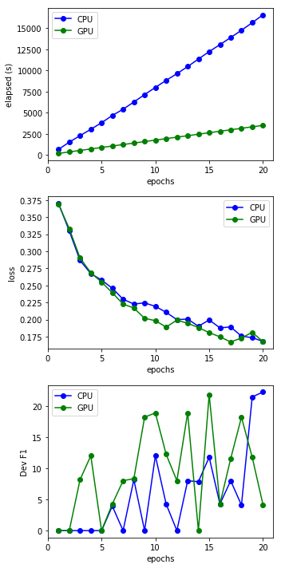

# snorkel-pytorch-lstm-gpu

Code for my GPU port of Snorkel's Pytorch discriminative model (LSTM).

## Installation

Note that this code was tested to work with snorkel-0.7.0.

I assume that you already have Snorkel installed as a conda environment. If not, please follow [instructions under the Quick Start section on the Snorkel github page](https://github.com/HazyResearch/snorkel#installation--dependencies). Once you have an environment set up, locate the folder for package snorkel.learning.pytorch. I do this by running a find like so:

    $ cd ~/anaconda3/envs/snorkel
    $ find . -name "noise_aware_model.py"

I get the following from the last command above:

    ./lib/python3.6/site-packages/snorkel/learning/pytorch/noise_aware_model.py
    ./lib/python3.6/site-packages/snorkel/learning/tensorflow/noise_aware_model.py

To make this code available under Snorkel, just link the `snorkel.learning.pytorch_gpu` folder so it is a sibling of the `snorkel.learning.pytorch` folder. In my case, I would use the following.

    $ cd ~/anaconda3/envs/snorkel/lib/python3.6/site-packages/snorkel/learning/
    $ ln -s /path/to/my/snorkel-pytorch-lstm-gpu/snorkel.learning.pytorch_gpu pytorch_gpu

## Calling

The following snippet shows how to instantiate and train the LSTM object in the `pytorch_gpu` package.

The `use_cudnn` parameter exists for `TorchNoiseAwareModel` (grandparent of `LSTM`) but does not seem to actually do anything. I set it up so that if it is set to True, the code will check for `torch.cuda.is_enabled()` and copy the module or variable to one of torch.device("cuda:0") or torch.device("cpu") so the operation can happen there. This is the pattern recommended in [Pytorch 0.4.0 migration guide](https://pytorch.org/blog/pytorch-0_4_0-migration-guide/). The general principle is that I set all the Modules that are used outside the `_build_model` function to GPU, as well as all Torch tensors that are accessed in the training loop (forward/backward).

```python
from snorkel.learning.pytorch_gpu.rnn import LSTM

train_kwargs = {
    "lr": 0.01,
    "dim": 1,
    "n_epochs": 20,
    "dropout": 0.5,
    "print_freq": 1,
    "batch_size": 10,
    "max_sentence_length": 4000
}

lstm = LSTM(n_threads=1)
lstm.train(train_cands, train_marginals, 
           X_dev=dev_cands, 
           Y_dev=L_gold_dev,
           dev_ckpt=True,
           save_dir=CHECKPOINT_DIR,
           use_cudnn=True,
           **train_kwargs)
```

## Results

I ran the training against a CPU box (with `snorkel.learning.pytorch.LSTM`) and GPU box (with `snorkel.learning.pytorch_gpu.LSTM`), and plotted the numbers from the console logs. The model itself does not perform very well, but the training time on CPU is approximately 5x longer than on GPU for comparable loss and dev F1 values.



